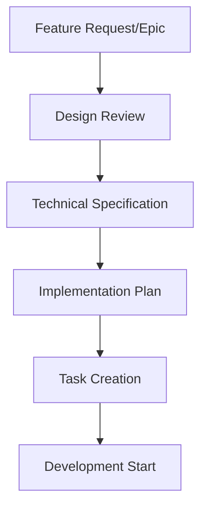
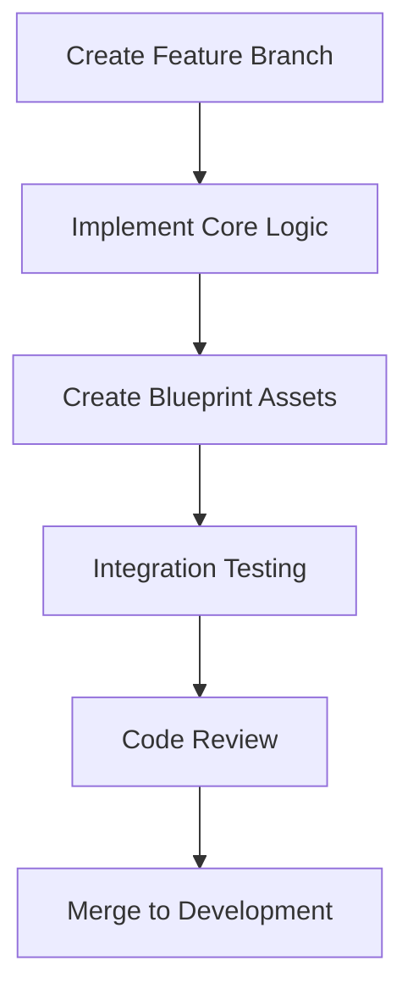
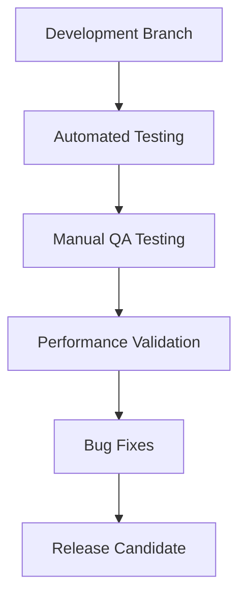
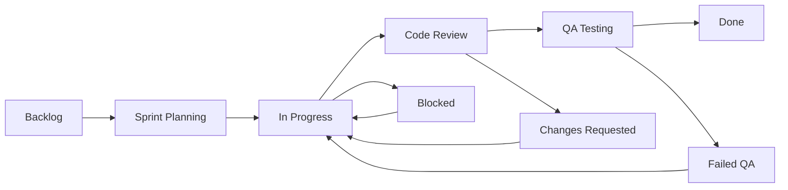

# ClimbingGame - Development Workflow Guide

## Overview
This guide establishes standardized development workflows for the ClimbingGame team, ensuring consistent processes, quality assurance, and efficient collaboration throughout the 18-week development cycle.

---

## 🔄 Development Lifecycle

### 1. Feature Development Workflow

#### Phase 1: Planning & Design


**Steps:**
1. **Feature Request Creation**: Document in roadmap with acceptance criteria
2. **Design Review**: Review against game design document and technical architecture
3. **Technical Specification**: Define implementation approach and dependencies
4. **Implementation Planning**: Break down into tasks with time estimates
5. **Task Assignment**: Distribute work across team members

#### Phase 2: Implementation


**Steps:**
1. **Branch Creation**: `git checkout -b feature/[system-name]-[feature-description]`
2. **Core Implementation**: C++ classes, core systems, data structures
3. **Blueprint Integration**: Visual scripting, UI elements, asset references
4. **Local Testing**: Unit tests, basic functionality verification
5. **Code Review**: Peer review using established standards
6. **Integration**: Merge to development branch after approval

#### Phase 3: Quality Assurance


**Steps:**
1. **Automated Testing**: Unit tests, integration tests, build verification
2. **Manual QA**: Feature testing according to QA framework
3. **Performance Testing**: Frame rate, memory usage, network latency validation
4. **Bug Resolution**: Fix issues, regression testing
5. **Release Preparation**: Final validation, documentation updates

---

## 🛠️ Daily Development Workflow

### Morning Routine (First 30 minutes)
1. **Sync Latest Changes**: `git pull origin development`
2. **Review Project Status**: Check implementation roadmap progress
3. **Daily Standup Planning**: Prepare current tasks and blockers
4. **Environment Verification**: Ensure UE5.6 project compiles and runs

### Development Session Structure
```
┌─ Development Session (4-6 hours) ─┐
│                                    │
│ 1. Task Implementation (60-90min)  │
│ 2. Testing & Validation (15-30min) │
│ 3. Documentation Update (15min)    │
│ 4. Break (15min)                   │
│ 5. Repeat cycle                    │
│                                    │
└────────────────────────────────────┘
```

### End-of-Day Routine (Last 30 minutes)
1. **Commit Progress**: Push changes to feature branch with descriptive messages
2. **Update Task Status**: Mark completed tasks in roadmap
3. **Document Blockers**: Note any issues for next day or team discussion
4. **Review Tomorrow's Goals**: Plan next day's priorities

---

## 📋 Task Management System

### Task Categories and Priorities

#### Priority Levels
- **P0 - Critical**: Blocking other work, system-breaking bugs
- **P1 - High**: Core features, major bugs affecting gameplay
- **P2 - Medium**: Quality of life, minor bugs, optimization
- **P3 - Low**: Nice-to-have features, documentation improvements

#### Task Types
- **Feature**: New gameplay systems or major functionality
- **Bug**: Issues requiring fixes
- **Technical**: Infrastructure, optimization, refactoring
- **Art**: Asset creation, UI/UX, visual improvements
- **QA**: Testing procedures, validation scripts

### Task Tracking Workflow


---

## 🔧 Technical Development Standards

### Code Development Process

#### 1. C++ Development
```cpp
// File Header Template
/*
 * ClimbingGame - [System Name]
 * 
 * Description: Brief description of class/system purpose
 * Author: [Your Name]
 * Created: [Date]
 * Last Modified: [Date]
 * 
 * Dependencies:
 * - List key dependencies
 * - Reference related systems
 */
```

**Standards:**
- Use consistent naming conventions (PascalCase for classes, camelCase for variables)
- Document complex functions with inline comments
- Follow Unreal Engine coding standards
- Include unit tests for business logic

#### 2. Blueprint Development
```
Blueprint Naming Convention:
- BP_[System][ComponentType]_[SpecificName]
- Examples:
  - BP_PlayerController_Climbing
  - BP_ToolComponent_Cam
  - BP_UIWidget_Inventory
```

**Standards:**
- Comment complex blueprint nodes
- Use consistent variable naming
- Group related nodes in comment boxes
- Minimize blueprint complexity (prefer C++ for complex logic)

### Testing Integration
Every feature must include:
1. **Unit Tests**: For C++ business logic
2. **Integration Tests**: For system interactions
3. **Blueprint Validation**: Ensure blueprint compilation
4. **Manual Test Cases**: Document test scenarios in QA framework

---

## 🤝 Collaboration Workflows

### Code Review Process

#### Review Requirements
- **All Code**: No direct commits to development branch
- **Review Time**: 24-hour maximum response time
- **Reviewers**: Minimum 1 peer, Lead for architecture changes
- **Criteria**: Functionality, code quality, documentation, test coverage

#### Review Checklist
- [ ] Code follows established standards
- [ ] Feature works as specified
- [ ] No performance regressions
- [ ] Documentation updated
- [ ] Tests included and passing
- [ ] No merge conflicts with development branch

### Knowledge Sharing

#### Weekly Tech Talks (30 minutes)
- **Monday**: Architecture discussions and system design
- **Wednesday**: Code review insights and best practices
- **Friday**: Progress demonstrations and problem-solving

#### Documentation Updates
- **Real-time**: Update implementation roadmap progress
- **Weekly**: Review and update technical architecture
- **Bi-weekly**: Cross-reference documentation accuracy

---

## 📊 Progress Monitoring

### Daily Metrics
- Lines of code added/modified
- Tests written and passing
- Blueprint assets created/updated
- Bugs fixed vs new bugs reported

### Weekly Metrics
- Feature completion rate vs roadmap timeline
- Code review cycle time
- Build success rate
- Test coverage percentage

### Milestone Reviews
- Feature completeness assessment
- Performance benchmark validation
- QA gate passage
- Documentation completeness check

---

## 🚨 Issue Resolution Workflow

### Bug Reporting Process
1. **Discovery**: Bug identified during development or testing
2. **Documentation**: Create detailed bug report with reproduction steps
3. **Triage**: Assign priority and responsible developer
4. **Investigation**: Root cause analysis and impact assessment
5. **Resolution**: Implement fix with appropriate testing
6. **Verification**: QA validation of fix
7. **Documentation**: Update any relevant documentation

### Escalation Process
- **Level 1**: Team member discussion
- **Level 2**: Lead developer consultation
- **Level 3**: Architecture review and redesign if necessary
- **Level 4**: External expertise or technology change

---

## 🔄 Continuous Improvement

### Retrospective Process
- **Weekly Mini-Retrospectives**: 15 minutes, focus on immediate improvements
- **Sprint Retrospectives**: End of each development phase, comprehensive review
- **Milestone Retrospectives**: Major project checkpoints, process evaluation

### Process Evolution
- Document workflow pain points and proposed solutions
- Experiment with process improvements in controlled manner
- Measure impact of changes on productivity and quality
- Integrate successful improvements into standard workflow

---

## 📚 Resources and References

### Essential Documentation
- [Implementation Roadmap](C:\Users\Zachg\ClimbingGame\IMPLEMENTATION_ROADMAP.md) - Development timeline and milestones
- [Technical Architecture](C:\Users\Zachg\ClimbingGame\TECHNICAL_ARCHITECTURE.md) - System design and integration
- [QA Testing Framework](C:\Users\Zachg\ClimbingGame\QA_TESTING_FRAMEWORK.md) - Testing procedures and quality gates

### Development Tools
- **IDE Setup**: Visual Studio 2022 with Unreal Engine integration
- **Version Control**: Git with feature branch workflow
- **Communication**: Team chat, video calls, shared documentation
- **Project Management**: Roadmap tracking, task assignments

### External Resources
- [Unreal Engine 5.6 Documentation](https://docs.unrealengine.com/)
- [Unreal Engine C++ Programming Guide](https://docs.unrealengine.com/5.6/en-US/programming-and-scripting-in-unreal-engine/)
- [Chaos Physics Documentation](https://docs.unrealengine.com/5.6/en-US/chaos-physics-in-unreal-engine/)

---

*This workflow guide is a living document that will be updated based on team feedback and project evolution. All team members are encouraged to suggest improvements and optimizations.*

**Version**: 1.0  
**Last Updated**: Week 1 - Foundation Setup  
**Next Review**: End of Week 2