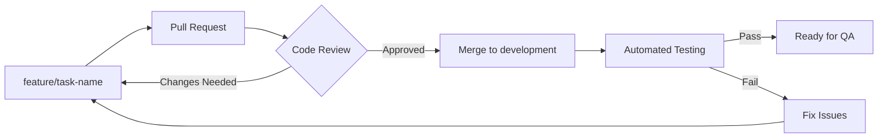

# ClimbingGame - Team Collaboration Standards

## Overview
This document establishes communication protocols, collaboration standards, and team practices to ensure effective teamwork throughout ClimbingGame's 18-week development cycle. These standards promote transparency, accountability, and knowledge sharing.

---

## 👥 Team Structure & Roles

### Core Team Roles
| Role | Primary Responsibilities | Communication Level |
|------|-------------------------|-------------------|
| **Lead Developer** | Architecture decisions, code review oversight, technical direction | High - Daily updates |
| **Gameplay Programmer** | Movement systems, tool mechanics, physics integration | Medium - Regular updates |
| **UI/UX Developer** | Interface design, user experience, accessibility | Medium - Regular updates |
| **Level Designer** | Environment creation, route design, gameplay flow | Medium - Regular updates |
| **QA Engineer** | Testing framework, bug tracking, quality assurance | Medium - Regular updates |
| **Technical Artist** | Pipeline optimization, asset integration, performance | Low - Weekly updates |

### Collaboration Matrix
```
           Lead  Game  UI/UX  Level  QA    Tech
Lead Dev   ████  ████  ███   ███   ████  ███
Game Prog  ████  ████  ██    ███   ███   ██
UI/UX Dev  ███   ██    ████  ██    ███   ██
Level Des  ███   ███   ██    ████  ███   ███
QA Eng     ████  ███   ███   ███   ████  ██
Tech Art   ███   ██    ██    ███   ██    ████

Legend: ████ Daily  ███ Regular  ██ Weekly  █ As-Needed
```

---

## 📢 Communication Protocols

### 1. Daily Standup Structure (15 minutes max)

#### Format: **Round Robin Updates**
Each team member provides:
1. **Yesterday's Accomplishments** (1 minute)
   - Completed tasks with reference to roadmap
   - Key technical decisions made
   - Blockers resolved

2. **Today's Goals** (1 minute)
   - Primary tasks from implementation roadmap
   - Expected challenges or dependencies
   - Collaboration needs

3. **Blockers & Requests** (1 minute)
   - Current obstacles requiring assistance
   - Resource or information needs
   - Cross-team coordination requirements

#### Example Update Template:
```
Yesterday: ✅ Implemented basic grip detection system (Week 2, Task 2.3)
           ✅ Created BP_GripPoint blueprint with strength calculation
           ⚠️  Encountered collision detection performance issue

Today:     🎯 Optimize grip detection with spatial partitioning
           🎯 Begin stamina system integration
           🤝 Need physics consultation with [Lead Developer]

Blockers:  🚧 Waiting for climbing surface materials from [Tech Artist]
           🚧 Performance profiling tools setup needed
```

### 2. Weekly Technical Sync (60 minutes)

#### Agenda Structure:
1. **Architecture Review** (20 minutes)
   - System integration updates
   - Performance metrics review
   - Technical debt assessment

2. **Cross-Team Dependencies** (15 minutes)
   - Blocking issues resolution
   - Resource allocation adjustments
   - Timeline coordination

3. **Knowledge Sharing** (20 minutes)
   - Technical discoveries and solutions
   - Best practices updates
   - Tool and process improvements

4. **Next Week Planning** (5 minutes)
   - Priority alignment with roadmap
   - Resource needs identification
   - Risk mitigation strategies

### 3. Milestone Reviews (90 minutes)

#### Review Categories:
- **Feature Completeness**: Progress against implementation roadmap
- **Quality Assessment**: QA framework compliance and test coverage
- **Performance Validation**: Benchmarks and optimization opportunities
- **Documentation Status**: Knowledge base updates and accuracy
- **Process Evaluation**: Workflow effectiveness and improvements

---

## 💬 Communication Channels

### Channel Organization

#### **#general-discussion**
- General team communication
- Non-urgent questions and updates
- Resource sharing and tips
- Team building and informal chat

#### **#development-updates** 
- Implementation progress reports
- Build status notifications
- Automated test results
- Deployment announcements

#### **#technical-discussion**
- Architecture discussions
- Problem-solving collaboration
- Code review discussions
- Performance optimization topics

#### **#qa-testing**
- Bug reports and testing results
- QA framework updates
- Test coverage discussions
- Quality gate notifications

#### **#design-feedback**
- Gameplay mechanic discussions
- Level design feedback
- UI/UX iteration reviews
- User experience insights

### Communication Response Expectations

| Channel Type | Response Time | Escalation |
|-------------|---------------|------------|
| **Urgent Issues** | 2 hours | Direct message/call |
| **Technical Questions** | 4 hours | Mention in daily standup |
| **General Discussion** | 24 hours | Follow up if no response |
| **Code Reviews** | 24 hours | Ping reviewer directly |
| **Documentation Updates** | 48 hours | Weekly review reminder |

---

## 📝 Documentation Collaboration

### 1. Real-Time Documentation Standards

#### Live Documentation Requirements:
- **Code Comments**: Document complex algorithms and business logic
- **Blueprint Comments**: Explain node group functionality and data flow
- **API Documentation**: Keep inline documentation current with code changes
- **Decision Logs**: Record architectural and design decisions with rationale

#### Documentation Ownership:
```
Document Type                Owner          Update Frequency
━━━━━━━━━━━━━━━━━━━━━━━━━━━━━━━━━━━━━━━━━━━━━━━━━━━━━━━━━━
Implementation Roadmap       Lead Dev       Daily progress updates
Technical Architecture       Lead Dev       Weekly reviews
Game Design Document         Game Prog      Bi-weekly iterations
Core Gameplay Mechanics      Game Prog      Weekly updates
QA Testing Framework         QA Engineer    Per milestone updates
Performance Optimization     Tech Artist    Weekly metrics
Development Workflows        Lead Dev       Monthly reviews
```

### 2. Collaborative Review Process

#### Documentation Review Cycle:
1. **Draft Creation**: Author creates initial documentation
2. **Peer Review**: Team members provide feedback and suggestions
3. **Technical Review**: Lead developer validates technical accuracy
4. **Implementation Alignment**: Verify documentation matches current code
5. **Final Approval**: Integrate into knowledge base with cross-references

#### Review Standards Checklist:
- [ ] **Accuracy**: Information reflects current implementation
- [ ] **Completeness**: All necessary details included
- [ ] **Clarity**: Writing is clear and accessible to all team members
- [ ] **Cross-References**: Proper links to related documentation
- [ ] **Examples**: Code samples and usage examples where appropriate
- [ ] **Version Control**: Document version and update history

---

## 🔧 Code Collaboration Standards

### 1. Branching Strategy

#### Branch Types and Naming:
```
main                    - Production-ready releases
└── development         - Integration branch for testing
    ├── feature/movement-system-stamina
    ├── feature/tools-rope-physics  
    ├── bugfix/grip-detection-performance
    └── hotfix/critical-memory-leak
```

#### Branch Workflow:


### 2. Code Review Collaboration

#### Review Request Process:
1. **Self-Review**: Author reviews own changes before requesting review
2. **Automated Checks**: Ensure build passes and tests run
3. **Review Assignment**: Assign appropriate reviewer based on code area
4. **Context Provision**: Include description of changes and testing done
5. **Responsive Iteration**: Address feedback promptly and thoroughly

#### Reviewer Responsibilities:
- **Functionality**: Verify code works as intended
- **Standards Compliance**: Check adherence to coding standards
- **Performance**: Identify potential performance impacts
- **Documentation**: Ensure adequate comments and documentation
- **Testing**: Validate test coverage and quality

#### Review Feedback Guidelines:
```
Feedback Types:
🔴 Must Fix     - Blocking issues that prevent merge
🟡 Should Fix   - Important improvements, negotiable
🔵 Consider     - Suggestions for improvement
✅ Praise       - Positive feedback for good practices
❓ Question     - Clarification needed
💡 Idea         - Alternative approaches or optimizations
```

---

## 🎯 Project Management Collaboration

### 1. Agile Practices Adaptation

#### Sprint Structure (2-week cycles):
- **Sprint Planning**: Define goals aligned with implementation roadmap
- **Daily Standups**: Track progress and resolve blockers
- **Sprint Review**: Demonstrate completed features to team
- **Retrospective**: Identify improvements and process adjustments

#### Task Management:
- **Backlog Grooming**: Weekly prioritization of upcoming tasks
- **Story Pointing**: Estimate effort using Fibonacci scale (1, 2, 3, 5, 8, 13)
- **Burn-down Tracking**: Monitor progress against sprint commitments
- **Velocity Tracking**: Measure team capacity for planning accuracy

### 2. Risk Management Collaboration

#### Risk Identification Process:
1. **Technical Risks**: Architecture scalability, performance bottlenecks
2. **Timeline Risks**: Feature complexity, dependency delays
3. **Quality Risks**: Test coverage gaps, integration issues
4. **Resource Risks**: Knowledge gaps, availability constraints

#### Risk Mitigation Strategies:
- **Early Warning Systems**: Automated alerts for build failures, performance degradation
- **Knowledge Sharing**: Cross-training on critical systems
- **Buffer Planning**: Build slack time into milestone schedules
- **Regular Check-ins**: Proactive communication about potential issues

---

## 🌟 Team Culture & Best Practices

### 1. Knowledge Sharing Culture

#### Learning Opportunities:
- **Pair Programming**: Collaborative coding on complex features
- **Code Walkthroughs**: Regular sessions explaining system architecture
- **Tool Training**: Sharing expertise with Unreal Engine tools and workflows
- **External Learning**: Share articles, tutorials, and conference talks

#### Mentorship Approach:
- **Buddy System**: Pair experienced with newer team members
- **Gradual Responsibility**: Increase complexity of assigned tasks over time
- **Constructive Feedback**: Focus on growth and improvement
- **Recognition**: Acknowledge learning progress and achievements

### 2. Problem-Solving Collaboration

#### Collaborative Problem-Solving Process:
1. **Problem Definition**: Clearly articulate the issue and impact
2. **Information Gathering**: Collect relevant data and context
3. **Brainstorming**: Generate multiple solution approaches
4. **Solution Evaluation**: Assess pros/cons of each approach
5. **Implementation Planning**: Define steps and responsibilities
6. **Progress Tracking**: Monitor solution effectiveness

#### When to Escalate:
- **Time Constraints**: Issue blocking critical path for >4 hours
- **Technical Complexity**: Problem requires architectural decisions
- **Resource Needs**: Solution requires additional tools or expertise
- **Cross-Team Impact**: Issue affects multiple team members or systems

---

## 📊 Collaboration Metrics & Improvement

### 1. Team Effectiveness Metrics

#### Communication Metrics:
- Daily standup participation rate
- Code review response time
- Documentation update frequency
- Issue resolution cycle time

#### Collaboration Quality Indicators:
- Cross-team knowledge sharing instances
- Pair programming hours
- Mentorship session frequency
- Process improvement suggestions

### 2. Continuous Improvement Process

#### Weekly Team Health Checks:
- **Communication Satisfaction**: Are team members getting needed information?
- **Workload Distribution**: Is work fairly and efficiently distributed?
- **Knowledge Gaps**: Are there areas where team needs more expertise?
- **Process Effectiveness**: Are our workflows helping or hindering progress?

#### Monthly Collaboration Reviews:
- Review collaboration metrics and trends
- Identify successful practices to maintain
- Address collaboration challenges and barriers
- Plan improvements for next month

---

## 📋 Quick Reference Guides

### Daily Workflow Checklist:
- [ ] Check team chat for overnight updates
- [ ] Pull latest changes from development branch
- [ ] Attend daily standup or post async update
- [ ] Update task status in implementation roadmap
- [ ] Commit and push progress at end of day
- [ ] Review and respond to assigned code reviews

### Weekly Responsibilities:
- [ ] Participate in technical sync meeting
- [ ] Update relevant documentation sections
- [ ] Conduct peer code reviews
- [ ] Share knowledge or learnings with team
- [ ] Plan next week's work alignment

### Communication Escalation Path:
```
Level 1: Team Chat Discussion
    ↓ (No resolution in 2 hours)
Level 2: Direct Message/Call
    ↓ (No resolution in 4 hours)
Level 3: Daily Standup Escalation
    ↓ (No resolution in 24 hours)
Level 4: Lead Developer Consultation
    ↓ (Architectural decision needed)
Level 5: Team Meeting/Architecture Review
```

---

*These collaboration standards are living guidelines that evolve with our team and project needs. All team members are encouraged to suggest improvements and optimizations based on their experience.*

**Version**: 1.0  
**Last Updated**: Week 1 - Foundation Setup  
**Next Review**: End of Week 4