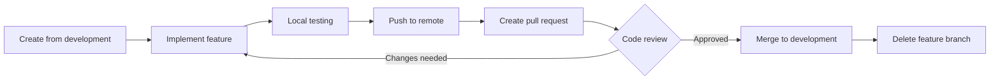
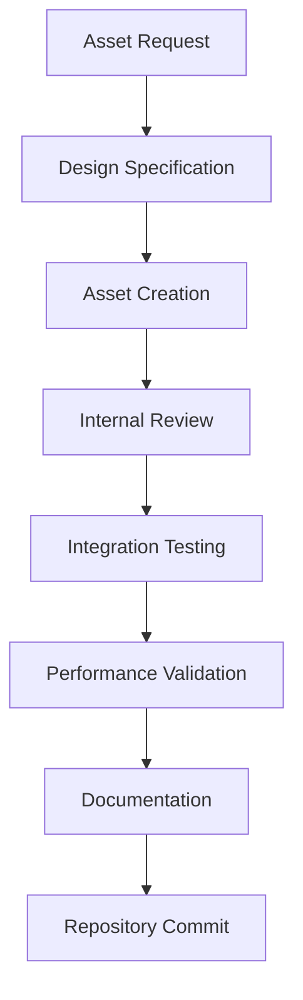

# ClimbingGame - Version Control & Asset Management Guidelines

## Overview
This document establishes comprehensive version control workflows and asset management procedures for ClimbingGame development. These guidelines ensure code integrity, asset organization, and effective collaboration across the 18-week development timeline.

---

## 🌿 Git Version Control Strategy

### Repository Structure
```
ClimbingGame/
├── .git/                     # Git repository data
├── .gitignore                # Ignore patterns for Unreal Engine
├── .gitattributes            # LFS and line ending configuration
├── Source/                   # C++ source code (tracked in Git)
├── Content/                  # Unreal Engine assets (Git LFS)
├── Config/                   # Project configuration files
├── *.md                      # Documentation (tracked in Git)
├── *.uproject               # Unreal project file (tracked in Git)
└── Binaries/                # Build outputs (ignored)
```

### Git Configuration

#### Essential .gitignore Rules:
```gitignore
# Unreal Engine Build Files
Binaries/
Intermediate/
Build/
DerivedDataCache/

# IDE and Editor Files
.vs/
.vscode/
*.sln
*.suo
*.tmp
*.tmp_proj
*.log

# OS Generated Files
.DS_Store
.DS_Store?
._*
.Spotlight-V100
.Trashes
Thumbs.db

# Unreal Engine Specific
*.VC.db
*.opendb
*.db
Saved/Autosaves/
Saved/Backup/
Saved/Config/CrashReportClient/
Saved/Logs/

# Custom Ignores for ClimbingGame
/Content/Movies/
/Content/Audio/Raw/
TestResults/
PerformanceProfiles/
```

#### Git LFS Configuration (.gitattributes):
```
# Unreal Engine Assets
*.uasset filter=lfs diff=lfs merge=lfs -text
*.umap filter=lfs diff=lfs merge=lfs -text
*.ubulk filter=lfs diff=lfs merge=lfs -text
*.uexp filter=lfs diff=lfs merge=lfs -text
*.uptnl filter=lfs diff=lfs merge=lfs -text
*.ufont filter=lfs diff=lfs merge=lfs -text

# Binary Assets
*.png filter=lfs diff=lfs merge=lfs -text
*.jpg filter=lfs diff=lfs merge=lfs -text
*.jpeg filter=lfs diff=lfs merge=lfs -text
*.gif filter=lfs diff=lfs merge=lfs -text
*.tga filter=lfs diff=lfs merge=lfs -text
*.bmp filter=lfs diff=lfs merge=lfs -text
*.tiff filter=lfs diff=lfs merge=lfs -text

# Audio Assets
*.wav filter=lfs diff=lfs merge=lfs -text
*.ogg filter=lfs diff=lfs merge=lfs -text
*.mp3 filter=lfs diff=lfs merge=lfs -text

# 3D Models
*.fbx filter=lfs diff=lfs merge=lfs -text
*.obj filter=lfs diff=lfs merge=lfs -text
*.max filter=lfs diff=lfs merge=lfs -text
*.blend filter=lfs diff=lfs merge=lfs -text

# Video Assets
*.mp4 filter=lfs diff=lfs merge=lfs -text
*.avi filter=lfs diff=lfs merge=lfs -text
*.mov filter=lfs diff=lfs merge=lfs -text
```

---

## 🔀 Branching Strategy

### Branch Structure and Workflow

#### Main Branches:
```
main                           # Production releases (protected)
├── development               # Integration and testing branch
│   ├── feature/movement-system-core        # New features
│   ├── feature/tools-rope-physics         # Major systems
│   ├── feature/ui-climbing-hud           # Interface features
│   ├── bugfix/grip-collision-detection   # Bug fixes
│   ├── hotfix/memory-leak-tools          # Critical fixes
│   └── experimental/ai-route-generation   # R&D work
```

#### Branch Naming Conventions:
```
Feature Branches:    feature/[system]-[component]-[description]
Bug Fix Branches:    bugfix/[issue-id]-[brief-description]
Hotfix Branches:     hotfix/[severity]-[brief-description]
Release Branches:    release/[version]-[milestone-name]
Experimental:        experimental/[research-area]-[description]

Examples:
feature/player-movement-stamina-system
feature/tools-inventory-ui-integration
bugfix/rope-physics-constraint-instability
hotfix/critical-multiplayer-desync
release/v0.1-foundation-milestone
experimental/procedural-route-generation
```

### Branch Lifecycle Management

#### Feature Branch Workflow:


#### Branch Protection Rules:
- **main**: No direct commits, requires pull request + 2 approvals
- **development**: No direct commits, requires pull request + 1 approval
- **feature/***: Direct commits allowed by branch owner only
- **hotfix/***: Fast-track review process, 1 approval required

---

## 📝 Commit Standards

### Commit Message Format
```
[TYPE][SCOPE]: Brief description (50 chars max)

Detailed explanation of changes (wrap at 72 characters)
- Key changes made
- Rationale for approach
- Related systems affected

References: #issue-number, Related: other-commits
Co-authored-by: Name <email@example.com>
```

#### Commit Types:
- **FEAT**: New feature implementation
- **FIX**: Bug fixes and corrections
- **REFACTOR**: Code restructuring without functional changes
- **PERF**: Performance improvements
- **DOCS**: Documentation updates
- **TEST**: Test additions or modifications
- **STYLE**: Code formatting and style changes
- **CHORE**: Build process, tool configuration changes

#### Scope Examples:
- **player**: Player movement, climbing, stamina systems
- **tools**: Inventory, tool mechanics, durability
- **physics**: Rope physics, collision detection, constraints
- **ui**: User interface, HUD, menus
- **network**: Multiplayer, replication, synchronization
- **level**: Level design, environment, routes
- **config**: Project settings, build configuration

#### Example Commits:
```
[FEAT][player]: Implement four-point grip system

Added individual finger tracking for realistic climbing mechanics
- Created grip strength calculation based on hold type
- Integrated stamina drain with grip duration
- Added visual feedback for grip security level

References: #42, Related: grip-detection-optimization
```

```
[FIX][physics]: Resolve rope constraint instability at high loads

Fixed rope segment constraint calculations causing breakage
- Updated spring constant calculations for better stability  
- Added safety limits for extreme force scenarios
- Improved performance by 15% through constraint optimization

References: #89
```

---

## 🗂️ Asset Management Strategy

### Asset Organization Structure

#### Content Directory Layout:
```
Content/
├── Blueprints/                    # All blueprint assets
│   ├── Player/                   # Character controllers, movement
│   ├── Tools/                    # Tool blueprints and mechanics
│   ├── Environment/              # Level elements, interactions
│   │   ├── ClimbingSurfaces/     # Surface types and properties
│   │   ├── Anchors/              # Anchor points and systems
│   │   ├── Routes/               # Route definitions and markers
│   │   ├── Hazards/              # Environmental dangers
│   │   └── Storytelling/         # Narrative elements
│   └── UI/                       # User interface elements
│       ├── HUD/                  # Heads-up display
│       ├── Menus/                # Menu systems
│       ├── Inventory/            # Inventory interfaces
│       └── Cooperative/          # Multiplayer UI
├── Materials/                     # Material assets
│   ├── Environment/              # Rock, terrain materials
│   ├── Tools/                    # Equipment materials
│   ├── UI/                       # Interface materials
│   └── Effects/                  # Particle and effect materials
├── Meshes/                       # 3D model assets
│   ├── Environment/              # Level geometry
│   ├── Tools/                    # Equipment models
│   ├── Characters/               # Character assets
│   └── Props/                    # Miscellaneous objects
├── Textures/                     # Texture assets
│   ├── Environment/              # Rock, terrain textures
│   ├── Tools/                    # Equipment textures
│   ├── UI/                       # Interface graphics
│   └── Effects/                  # Particle textures
├── Audio/                        # Sound assets
│   ├── Effects/                  # Sound effects
│   ├── Music/                    # Background music
│   └── Voice/                    # Voice acting, dialogue
├── Maps/                         # Level maps
│   ├── Tutorial/                 # Learning levels
│   ├── Intermediate/             # Standard gameplay
│   ├── Cooperative/              # Multiplayer focused
│   └── Testing/                  # Development test maps
└── LevelDesign/                  # Level design documents
```

### Asset Naming Conventions

#### Naming Standards by Type:
```
Blueprints:       BP_[System][Type]_[Description]
Materials:        M_[Surface/Type]_[Description]  
Textures:         T_[Type]_[Description]_[Variant]
Meshes:           SM_[Category]_[Description]
Audio:            A_[Type]_[Description]
Maps:             L_[Difficulty]_[LocationName]
Widgets:          WBP_[System]_[Description]

Examples:
BP_PlayerController_Climbing
BP_ToolComponent_Cam_SpringLoaded
M_Environment_Granite_Rough
T_Rock_Granite_Diffuse_01
SM_Tools_Cam_Size2
A_SFX_RopeCreak_Tension
L_Tutorial_CliffFace
WBP_Inventory_ToolSelection
```

### Asset Lifecycle Management

#### Asset Creation Workflow:


#### Asset Quality Gates:
1. **Design Compliance**: Matches game design document specifications
2. **Technical Standards**: Meets performance and memory requirements
3. **Integration Testing**: Works correctly within game systems
4. **Documentation**: Includes usage notes and parameter documentation
5. **Version Control**: Properly committed with descriptive messages

---

## 🔄 Daily Version Control Workflows

### Developer Daily Workflow

#### Morning Routine (10 minutes):
```bash
# 1. Switch to development branch
git checkout development

# 2. Pull latest changes
git pull origin development

# 3. Check for merge conflicts or issues
git status

# 4. Create/switch to feature branch
git checkout -b feature/player-stamina-system
# or
git checkout feature/player-stamina-system

# 5. Verify Unreal project opens correctly
# Open ClimbingGame.uproject in UE5.6 Editor
```

#### Development Session:
```bash
# Commit frequently with descriptive messages
git add Source/ClimbingGame/Player/StaminaComponent.cpp
git add Source/ClimbingGame/Player/StaminaComponent.h
git commit -m "[FEAT][player]: Add stamina component base structure

Created stamina component with consumption and recovery rates
- Configurable max stamina and depletion rates
- Event-driven stamina change notifications
- Integration points for UI and movement systems

References: #45"

# Push changes regularly
git push origin feature/player-stamina-system
```

#### End-of-Day Routine (5 minutes):
```bash
# 1. Commit all work in progress
git add .
git commit -m "[WIP][player]: Stamina system UI integration

Partial implementation of stamina bar display
- Created blueprint binding for stamina events
- Working on HUD positioning and styling

TODO: Complete animation and edge case handling"

# 2. Push to remote for backup
git push origin feature/player-stamina-system

# 3. Update task status in implementation roadmap
# 4. Note any blockers or issues for tomorrow
```

### Team Synchronization

#### Weekly Sync Process:
1. **Monday Morning**: All team members sync with development branch
2. **Wednesday Check-in**: Review pull request status and merge conflicts
3. **Friday Integration**: Merge approved features to development branch
4. **Weekend Preparation**: Prepare development branch for next week's work

---

## 🚨 Conflict Resolution

### Merge Conflict Resolution

#### Common Conflict Scenarios:
1. **Blueprint Conflicts**: Multiple developers modifying same blueprint
2. **C++ Header Conflicts**: Simultaneous changes to class definitions
3. **Project Settings**: Configuration changes by different team members
4. **Asset References**: Moving or renaming assets causing reference breaks

#### Resolution Process:
```bash
# 1. Identify conflicted files
git status

# 2. Use appropriate merge tool
git mergetool

# For Blueprint conflicts, use Unreal Engine's merge tool:
# Engine/Binaries/Win64/UnrealVersionSelector.exe -diff

# 3. Test resolution thoroughly
# - Build project successfully
# - Run basic functionality tests
# - Verify no systems are broken

# 4. Commit resolution
git add .
git commit -m "[FIX][merge]: Resolve blueprint conflict in player controller

Merged stamina system changes with movement improvements
- Maintained both feature implementations
- Verified all systems function correctly
- Updated component references

References: merge of feature/stamina + feature/movement-opt"
```

### Asset Conflict Prevention

#### Strategies:
1. **Clear Asset Ownership**: Assign primary owners for shared assets
2. **Communication**: Announce asset modifications in team chat
3. **Branching**: Create separate branches for major asset overhauls
4. **Backup**: Maintain backup copies of critical assets before modifications

---

## 📊 Repository Health Monitoring

### Key Metrics to Track

#### Repository Statistics:
- **Commit Frequency**: Daily commit count per developer
- **Branch Lifespan**: Time from creation to merge
- **Code Review Time**: Average time from PR creation to merge
- **Conflict Frequency**: Number of merge conflicts per week
- **Build Success Rate**: Percentage of successful automated builds

#### Asset Management Metrics:
- **Asset Growth**: Rate of new asset additions
- **Repository Size**: Total size and growth rate (important for Git LFS)
- **Asset Usage**: Tracking of referenced vs unreferenced assets
- **Performance Impact**: Memory usage and load times for new assets

### Health Check Procedures

#### Daily Automated Checks:
- Build verification on development branch
- Basic functionality smoke tests
- Repository size monitoring
- LFS bandwidth usage tracking

#### Weekly Manual Reviews:
- Dead code and unused asset cleanup
- Performance regression analysis
- Documentation synchronization check
- Security and access review

---

## 🔧 Tools and Integration

### Recommended Git Tools

#### Command Line Tools:
- **Git**: Core version control functionality
- **Git LFS**: Large file storage for Unreal assets
- **tig**: Terminal-based Git repository browser
- **git-flow**: Branching model automation

#### GUI Applications:
- **SourceTree**: Visual Git interface with LFS support
- **GitKraken**: Advanced Git client with merge conflict resolution
- **GitHub Desktop**: Simple interface for basic Git operations
- **P4Merge**: Advanced merge tool for complex conflicts

### IDE Integration

#### Visual Studio 2022:
- Git integration for C++ development
- Built-in diff and merge tools
- Team Explorer for repository management
- Live Share for collaborative coding

#### Unreal Engine Editor:
- Source Control integration (Git plugin)
- Asset diff tools for blueprints and materials
- Blueprint merge tools for conflict resolution
- Revision control interface

---

## 📋 Quick Reference

### Common Git Commands for ClimbingGame:

#### Daily Operations:
```bash
# Sync with latest changes
git checkout development && git pull origin development

# Create feature branch
git checkout -b feature/system-component-description

# Stage and commit changes
git add . && git commit -m "[TYPE][scope]: description"

# Push changes
git push origin feature/system-component-description

# Create pull request (via GitHub/platform interface)
```

#### Weekly Operations:
```bash
# Update feature branch with latest development
git checkout feature/branch-name
git rebase development

# Clean up merged branches
git branch -d feature/completed-feature-name
git push origin --delete feature/completed-feature-name

# Check repository health
git log --oneline --graph --all
git status
```

### Asset Management Checklist:

#### Before Committing Assets:
- [ ] Asset follows naming convention
- [ ] Asset is properly organized in Content directory
- [ ] Asset has been tested in-game
- [ ] Asset meets performance requirements
- [ ] Related documentation updated
- [ ] Asset references are valid

#### Before Major Asset Changes:
- [ ] Communicated changes to team
- [ ] Created backup of original assets
- [ ] Verified no other team members are modifying same assets
- [ ] Planned testing strategy for changes
- [ ] Updated implementation roadmap if necessary

---

*This version control and asset management guide ensures code integrity and team collaboration efficiency throughout ClimbingGame development. Regular reviews and updates keep these practices aligned with project needs.*

**Version**: 1.0  
**Last Updated**: Week 1 - Foundation Setup  
**Next Review**: End of Week 2